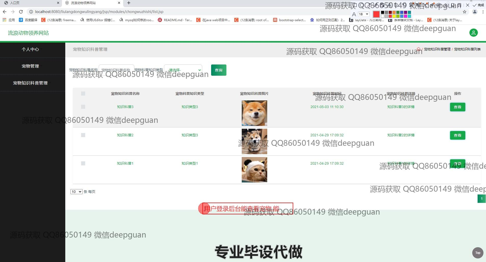

<h1 align="center">基于SSM的宠物领养系统</h1>

## 简介
基于Spring、Spring MVC、MyBatis的宠物领养系统：角色分为管理员、用户；支持用户管理、宠物管理、知识科普、分类管理及领养信息更新等核心功能。界面简洁，用户友好。    --计算机毕业设计源码；毕设源码；java毕业设计源码

## 联系方式

<h3 align="center">获取完整代码与数据库文件 + 微信：deepguan QQ: 86050149 QQ群: 783742310</h3>

<h3 align="center">可帮忙远程部署 包运行成功！提供远程部署、修改代码、设计文档指导、代码讲解等服务！</h3>

## 功能介绍（完整见运行截图）
管理员：管理用户注册、登录和退出系统的权限可控功能。负责系统主导航栏管理，包括轮播图管理、宠物信息展示及科普知识管理。具备宠物信息管理功能，包括录入、修改、分类和删除的权限。管理科普知识模块，可以编辑、增加、删除和查询相关内容。负责审核并处理用户提交的宠物领养申请。拥有基础数据管理的权限，确保系统运行稳定且数据准确无误。

用户：可以进行账户注册、登录和退出的基本操作。访问网站首页时，可以看到主导航栏和系统推荐的宠物。通过系统提供的查询功能，可以搜索感兴趣的宠物，根据不同的条件进行筛选查看。拥有个人中心，能查看账户信息，并进行个人信息的修改。可以提交宠物领养申请，查看申请进度。可以收藏感兴趣的宠物，便于日后查看。

## 运行截图

本代码来源于网络,仅供学习参考使用!

